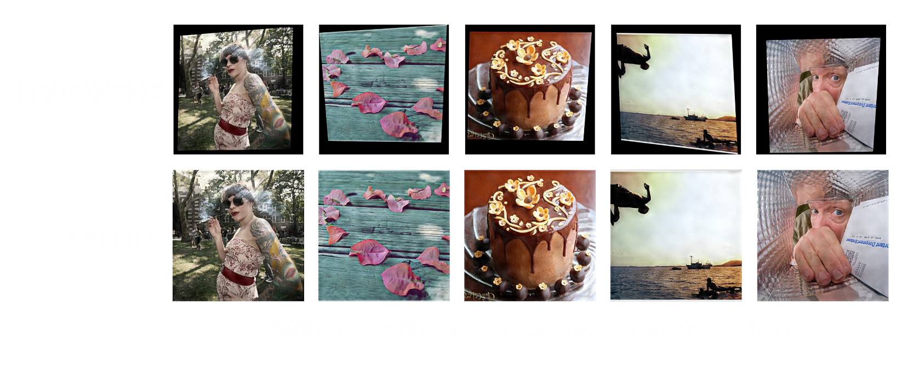
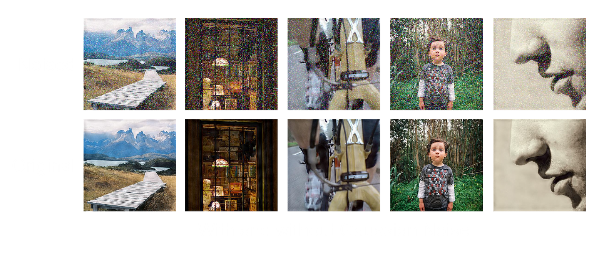

# Performing Image Augmentation

## Description
This project directory transforms the encoded images from the MIRFLICKR Dataset via the following different augmentation methods:
- Perspective Warp
- Motion Blur
- Color Shift
- Gaussian Noise
- JPEG Compression

Each method is implemented with an internal random variable to ensure data variation.

### Examples





## Setup

### Dataset

This project dir assumes that `../mirflickr25k-preprocessing` has been executed. The following dataset folder structure is expected before running this project: 

    ├── assets
        ├── stegastamp-encoded
            ├── <all unfoldered imgs in .jpg>
            ├── labels
                ├── <all unfoldered labels>

*Arrangement is performed manually*

### Script

1. Start the venv environment

```sh
source  env/bin/activate
```

2. Install python dependencies

```sh
pip install -r requirements. txt
```

3. Run the transformations

```sh
python main.py
```
